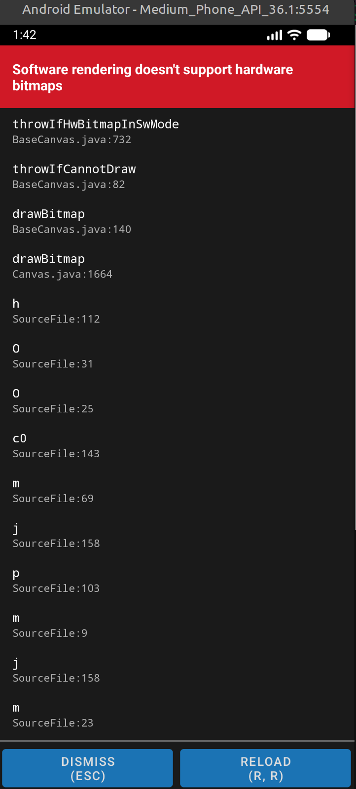

# Desafio Gateway

Esse repositório contém a solução do desafio técnico da Digital Gateway.

## Como rodar

1. Clone o repositório
   ```bash
      https://github.com/karendantas/desafio-tecnico-gateway.git
   ```
2. Instale as dependências

   ```bash
   npm install
   ```

3. Start the app

   ```bash
   npx expo start
   ```

4. Se no primerio load do app aparecer esse erro, basta dar reload no app.

Esse erro vem do Android, que ainda não tem suporte ao BlurView, e o uso experimental do efeito vem através da prop `experimentalBlurMethod="dimezisBlurView`, que não é recomendada para produção. Mas para alcançar os efeitos visuais do figma deixei ativo.



## Demonstração

## Decisões técnicas

- Sobre a autenticação
  Utilizo sempre um `AuthContext` para agrupar as funções, de cadastro, login, logout, dados do usuários e armazenamento de tokens. Para tornar o acesso a esses métodos disponível em qualquer tela/componente.

  Utilizo o "expo-secure-storage" para guardar dados sensíveis como os tokens de auteticação, pois é mais seguro que o "async-storage"

  Redirecionamentos no \_layout.tsx do app, usando o Stack.Protected, que permite proteger as telas privadas e deixar telas de auth públicas.

- Comunicação com a API
  Utilizei a lib "apollo" que é a mais recomendada para Graphql e possui uma aba dedicada ao react native na documentação

- Tratativas de erros
  Usei os metodos de OnCompleted e OnError que o próprio apollo oferece para criar
  Alerts de sucesso ou erro.

  Estados de loading e telas de carregamento para melhor usabilidade para o usuário

- Componentes e estilizações
  Normalmente prefiro usar o stylesheet padrão, pois a medida que o projeto cresce e se torna "bare workflow" que seria criar um ambiente de desenvolvimento personalizado, libs como "react-native-unistyles" podem ser utilizadas para aumentar perfomance dos styles.

## O que faria com mais tempo

- Melhorias nos formularios. Pra esse projeto decidi usar estados e regex simples para validar os campos dos formulários. Mas o ideal é combinar zod e `react-hook-form`

- Melhorar a vsibilidade dos formulários com `KeyboardAvoidingView` quando o teclado esta ativo

- Buscar outra alternativa para os efeitos de Blur no Android

- Melhorar Grids das imagens

- Criar um theme de cores para melhor padronização do tema.
